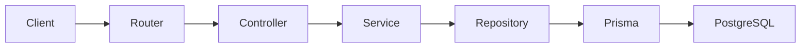

# Architecture

The backend follows a layered architecture with clear separation between routes, controllers, services, repositories, validators, middlewares, and utilities.

```mermaid
flowchart LR
    Client --> Router
    Router --> Controller
    Controller --> Service
    Service --> Repository
    Repository --> Prisma
    Prisma --> PostgreSQL
```
