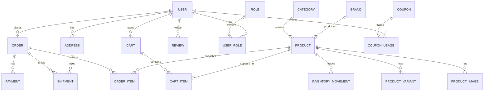

# ERD

```mermaid
erDiagram
  USER ||--o{ ADDRESS : has
  USER ||--o{ CART : owns
  USER ||--o{ ORDER : places
  USER ||--o{ REVIEW : writes
  ROLE ||--o{ USER_ROLE : assigns
  USER ||--o{ USER_ROLE : has
  CATEGORY ||--o{ PRODUCT : contains
  BRAND ||--o{ PRODUCT : produces
  PRODUCT ||--o{ PRODUCT_IMAGE : has
  PRODUCT ||--o{ PRODUCT_VARIANT : has
  PRODUCT ||--o{ INVENTORY_MOVEMENT : tracks
  CART ||--o{ CART_ITEM : contains
  PRODUCT ||--o{ CART_ITEM : appears_in
  ORDER ||--o{ ORDER_ITEM : contains
  ORDER ||--o{ PAYMENT : has
  ORDER ||--o{ SHIPMENT : ships
  ADDRESS ||--o{ SHIPMENT : uses
  COUPON ||--o{ COUPON_USAGE : tracks
  USER ||--o{ COUPON_USAGE : uses
  PRODUCT ||--o{ ORDER_ITEM : snapshot
```

The schema stores historical snapshots in order items and keeps inventory movements for stock auditing.